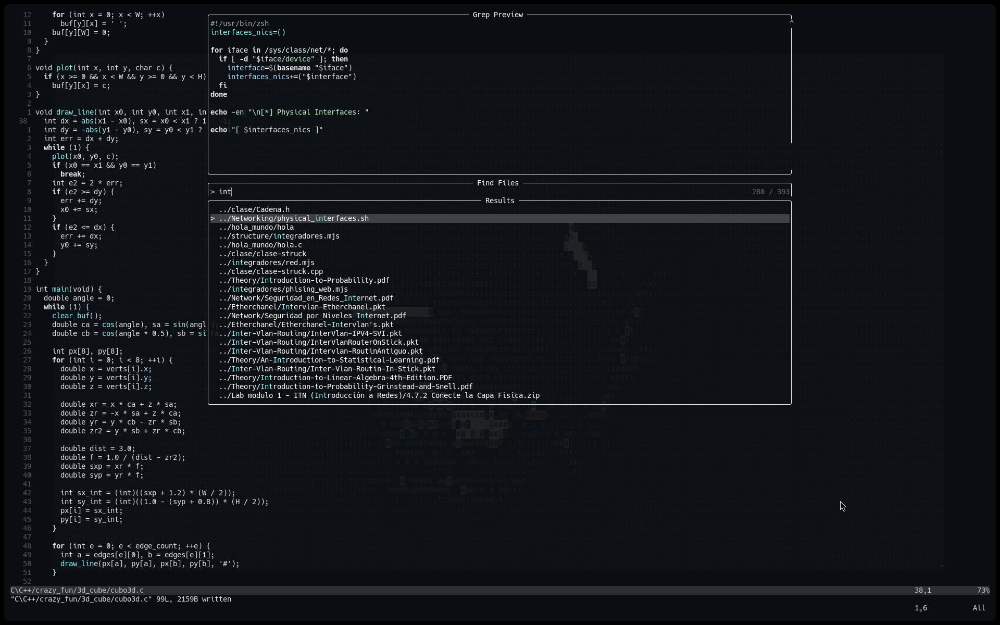
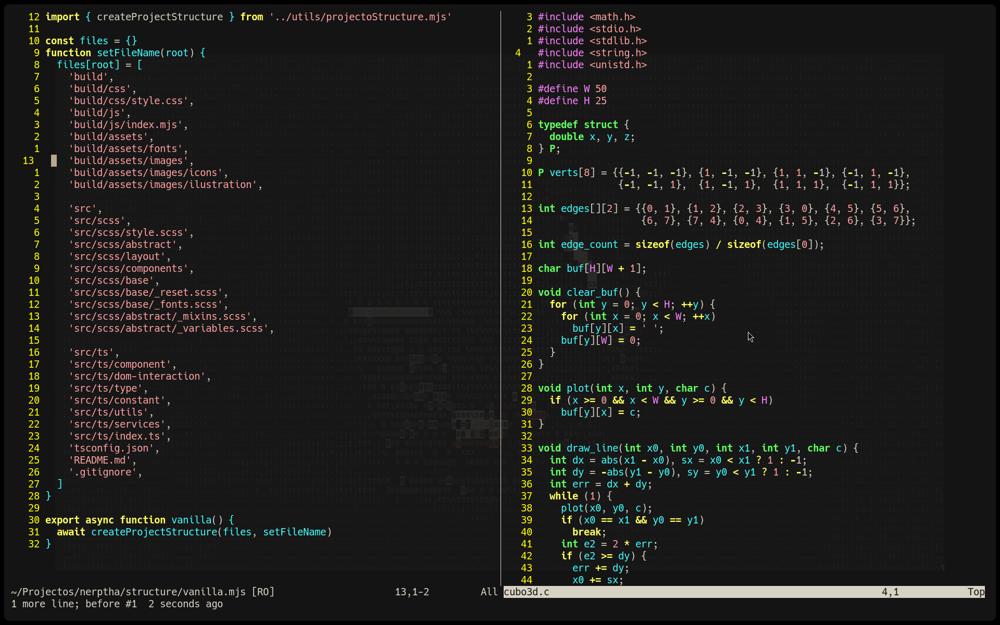
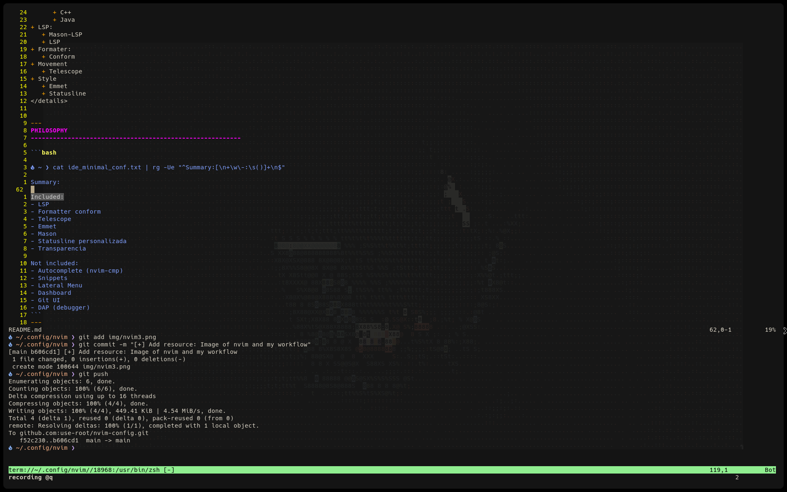
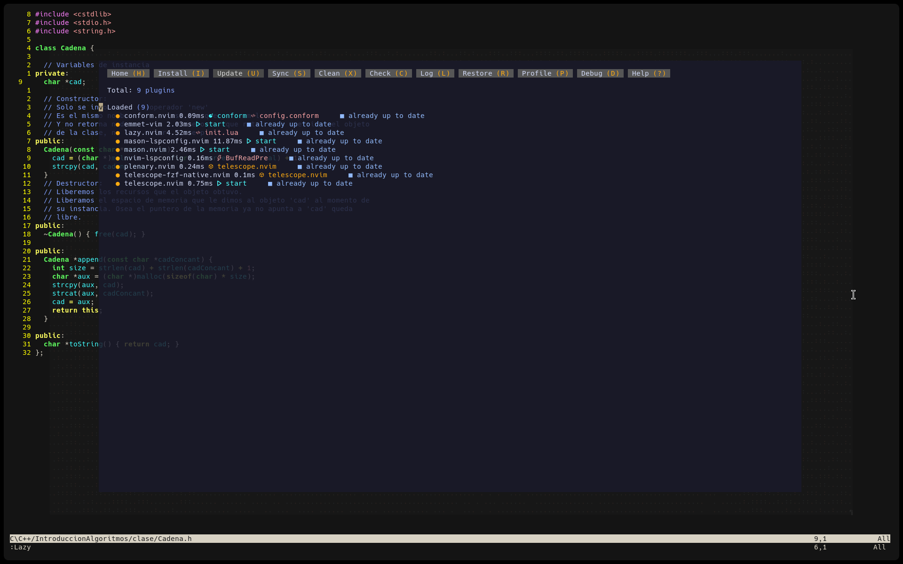
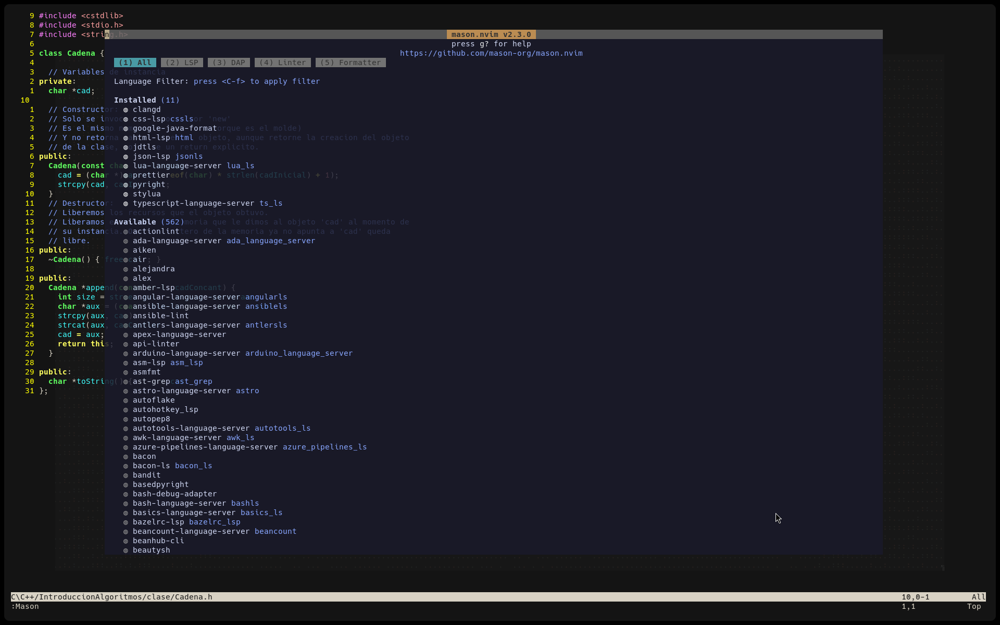
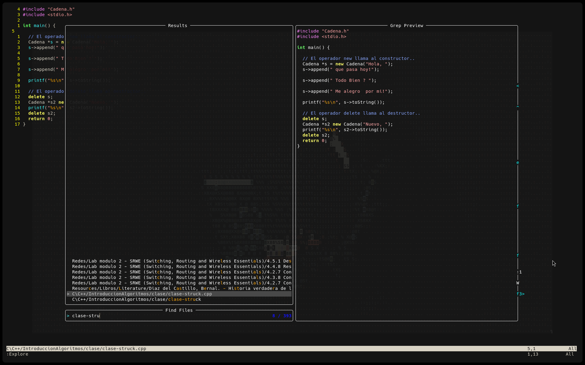

<div align="center">
  <h1>My Minimal Configuration NEOVIM</h1>
  <h4>Written in lua</h4>
  <p>
    
    <a href="https://github.com/ntk148v/neovim-config/releases/latest">
        
    </a>
  </p>
  <br />
</div>


Note: **This configuration is constantly updated**

**State Now:**
---------------------------------------------------------

`Total plugins: 9`
<details>
<summary>Summary</summary>

+ markdown Package's:
   + Lazy (Plugins)
   + Mason (Linters,Formatters...)
      + JavaScript
      + TypeScript
      + HTML
      + CSS
      + JSON
      + Python
      + C
      + C++
      + Java
+ LSP:
   + Mason-LSP
   + LSP
+ Formater:
   + Conform
+ Movement 
   + Telescope
+ Style
   + Emmet
   + Statusline 
</details>


---
PHILOSOPHY
---------------------------------------------------------

```bash

󰈸 ~ ❯ cat ide_minimal_conf.txt | rg -Ue "^Summary:[\n+\w\-:\s()]+\n$"

Summary:

Included:
- LSP
- Formatter conform
- Telescope
- Emmet
- Mason
- Statusline personalizada
- Transparencia

Not included:
- Autocomplete (nvim-cmp)
- Snippets
- Lateral Menu
- Dashboard
- Git UI
- DAP (debugger)
```
---

Screenshots
---------------------------------------------------------
|                                                                        |                                                                        |
| ---------------------------------------------------------------------- | ---------------------------------------------------------------------- |
|        |       |
|        |        |


---
Installed plugins:
---------------------------------------------------------

```bash

󰈸 ~ ❯ cat ide_minimal_conf.txt | rg -Ue "^Plugins:[\n+\w\-:\s()]+\n$"
```

### 1. lazy.nvim

**Plugins Manager.**



Functions:
 + Install plugins.
 + Update plugins.
 + Load/Sync plugins

```bash
Command: ':Lazy'

u     -> upadate plugins
U     -> update all
x     -> clear plugins
q     -> quit :3
```

---
### 2. mason.nvim

`Formatter:3 and LSP:9`

**External tool manager.**



Funciones:
+ Install LSP
+ Install formatters
+ Install linters

```bash
command: Mason

:MasonInstall <Tool>
:MasonUninstall <Tool>
```
---
### 3. mason-lspconfig.nvim

Work like a bridge:

Mason -> Install the server -> LSP use it

```lua

local mason = require("mason")
local mason_lsp = require("mason-lspconfig")

mason.setup()

mason_lsp.setup({
	ensure_installed = {
		"ts_ls",
		"pyright",
		"lua_ls",
		"html",
		"cssls",
		"jsonls",
		"clangd",
		"jdtls",
	},
})
```
---
### 4. nvim-lspconfig

Language configuration:

|Language  | LSP   |
|---|---|
|python   | pyright   |
|Lua   | lau_ls  |
|C/C++   | clangd    |
|Java   |  jdtls |
|HTML|  html |
|CSS   |  cssls |
|JS/TS/JSON |ts_ls   |


---
### 5. conform.nvim

|Language|Formatters|
|---|---|
|lua|stylua|
|python|black|
|web|prettier|
|java|google-java-format|
|c/c++|clang-format   |

---
### 6. telescope.nvim

**Main search.**



```lua
<leader>ff looking for files.

<leader>fg: Looking for some text inside the project
```
---
### emmet-vim

Shortcuts HTML, with `<C-Y>,`, the caracter ',' isn't a option.

Example:

```html
ul>li*5

TAB

Resultado:

<ul>
  <li></li>
  <li></li>
  <li></li>
  <li></li>
  <li></li>
</ul>
```
---
